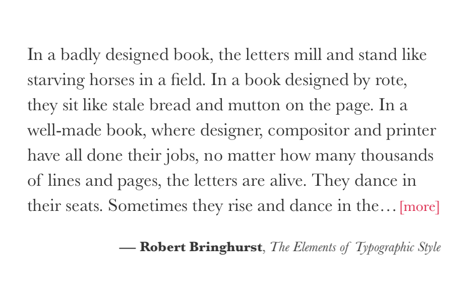

# Framer `Label` module



Create a layer that is the intrinsic size (height and width) of the text content
it contains. There is also support for single/multi-line truncation.

Check out the [example](http://share.framerjs.com/v9l2rpmlnsju/) or
clone/download this repo, open it in [Framer Studio](http://framerjs.com/)
and play around.

**Note:** This module depends on the beta `Utils.textSize` method, so be sure to
"File > Update Framer&hellip;".

## Usage
```shell
$ cd <myProject>.framer
$ npm install framer-label
```

modules/myModule.coffee:
```coffeescript
exports.Label = require "framer-label"
```

app.coffee:
```javascript
{Label} = require "myModule"

new Label
  text: "One great label"
  lineHeight: 1.5
  lineNumber: 2
  maxWidth: 100
```

## API

### `Layer#lineNumber <number>`
Represents the max number of lines a label can have. This only applies when
there is a constraining `maxWidth` set. Set to `0`, `null` or any other falsey
value to stop truncation and render the label at its inherit height.

### `Layer#maxWidth <number>`
Constrain the label’s width and truncate any overflowing text. If the `text` is
shorter than the set `maxWidth`, the label will shrink to that inherit
size.

### `Layer#text <string>`
The text (and/or HTML) to display.

### `Layer#<css-typography-property>`
All the [CSS typography properties][CSS props] are `Label` properties as well. No need
to `myLabel.style.lineHeight = 1.5`.

## License
The MIT License (MIT)

Copyright (c) 2015 Pete Schaffner

Permission is hereby granted, free of charge, to any person obtaining a copy
of this software and associated documentation files (the "Software"), to deal
in the Software without restriction, including without limitation the rights
to use, copy, modify, merge, publish, distribute, sublicense, and/or sell
copies of the Software, and to permit persons to whom the Software is
furnished to do so, subject to the following conditions:

The above copyright notice and this permission notice shall be included in all
copies or substantial portions of the Software.

THE SOFTWARE IS PROVIDED "AS IS", WITHOUT WARRANTY OF ANY KIND, EXPRESS OR
IMPLIED, INCLUDING BUT NOT LIMITED TO THE WARRANTIES OF MERCHANTABILITY,
FITNESS FOR A PARTICULAR PURPOSE AND NONINFRINGEMENT. IN NO EVENT SHALL THE
AUTHORS OR COPYRIGHT HOLDERS BE LIABLE FOR ANY CLAIM, DAMAGES OR OTHER
LIABILITY, WHETHER IN AN ACTION OF CONTRACT, TORT OR OTHERWISE, ARISING FROM,
OUT OF OR IN CONNECTION WITH THE SOFTWARE OR THE USE OR OTHER DEALINGS IN THE
SOFTWARE.

[CSS props]: https://developer.mozilla.org/en-US/docs/Web/CSS/Reference
